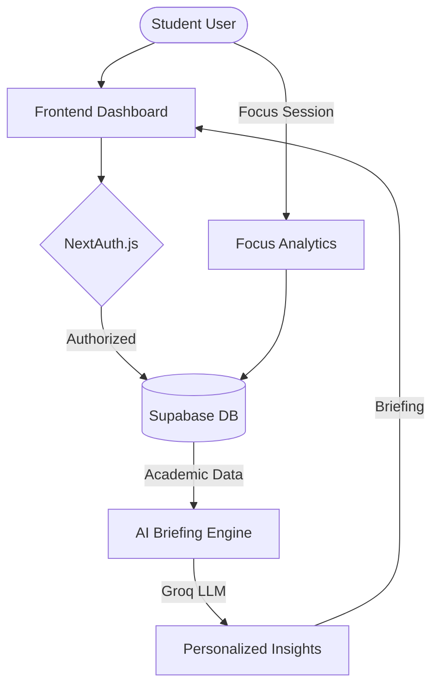

<div align="center">
  
  <p><strong>The ultimate AI-powered command center for academic excellence.</strong></p>

  <p>
    
    
    
    
  </p>

  <p>
    <a href="#-features">Features</a> •
    <a href="#-architecture">Architecture</a> •
    <a href="#-tech-stack">Tech Stack</a> •
    <a href="#-setup">Setup</a> •
    <a href="#-project-structure">Structure</a>
  </p>
</div>

---

## 🚀 Overview

**StudyBoard** is a sophisticated, student-centric productivity platform that leverages artificial intelligence to streamline academic workflows. It unifies task management, focus tracking, and grade analytics into a single, cohesive dashboard designed to eliminate cognitive load and maximize student performance.

> [!IMPORTANT]
> **Free Forever Core**: StudyBoard is committed to providing its essential features for free to students everywhere.

---

## ✨ Features

### 🤖 AI-Powered Intelligence
*   **Daily Strategic Briefings**: Wake up to a generated summary of your day, highlighting critical deadlines and recommended focus blocks.
*   **Adaptive Scheduling**: AI-driven task prioritization based on your current energy levels and mood.

### ⏱️ Performance & Focus
*   **Deep Work Timer**: Integrated Pomodoro timer with streak tracking and ambient sound support.
*   **Focus Analytics**: Visualize your "Deep Work" hours and productivity trends.

### � Academic Excellence
*   **Grade Forecasting**: Real-time GPA calculations and predictive analytics for upcoming exams.
*   **Syllabus Management**: Keep track of subject requirements and progress in one place.

### 🎮 Behavioral Design
*   **Gamified Achievement System**: Earn XP for task completion and maintain daily streaks to level up your "Scholar Profile."

---

## 📐 Architecture

The following diagram illustrates how StudyBoard processes your academic data to provide AI-driven insights:



---

## 🛠️ Tech Stack

| Layer | Technology |
| :--- | :--- |
| **Frontend** | [Next.js 15+](https://nextjs.org/), [Tailwind CSS 4.0](https://tailwindcss.com/) |
| **UI Components** | [Shadcn UI](https://ui.shadcn.com/), [Framer Motion](https://www.framer.com/motion/) |
| **Backend/API** | Next.js App Router, [Groq SDK](https://groq.com/) |
| **Database/ORM** | [Prisma](https://www.prisma.io/), [Supabase/PostgreSQL](https://supabase.com/) |
| **Authentication** | [NextAuth.js](https://next-auth.js.org/) |
| **Communications** | [Resend](https://resend.com/) |

---

## 🏗️ Project Structure

```text
study_board/
├── app/                  # Next.js App Router (Pages & API)
│   ├── api/              # AI, Auth, and Database endpoints
│   ├── (auth)/           # Authentication flows
│   └── (dashboard)/      # Protected dashboard routes
├── components/           # Reusable UI components (Shadcn + Custom)
│   ├── academics/        # Grade & Syllabus components
│   └── focus/            # Timer & Analytics components
├── lib/                  # Shared utilities (Prisma client, AI helpers)
├── prisma/               # Database schema & migrations
└── public/               # Static assets & icons
```

---

## 🛠️ Setup & Local Development

### Prerequisites
- Node.js 18.x or later
- A PostgreSQL instance (Supabase recommended)

### 1. Installation
```bash
git clone https://github.com/tripathiji1312/study_board.git
cd study_board
npm install
```

### 2. Configuration
Copy the `.env.example` (or use the template below) into a `.env` file:

```env
DATABASE_URL="postgresql://..."
DIRECT_URL="postgresql://..."
NEXTAUTH_SECRET="your-secret-here"
NEXTAUTH_URL="http://localhost:3000"
GROQ_API_KEY="gsk_..."
```

### 3. Initialization
```bash
npx prisma generate
npx prisma db push
npm run dev
```

---

## 🤝 Contributing

We welcome contributions from the community! To contribute:
1.  **Fork** the repository.
2.  **Create** a new branch (`git checkout -b feature/amazing-feature`).
3.  **Commit** your changes (`git commit -m 'Add amazing feature'`).
4.  **Push** to the branch (`git push origin feature/amazing-feature`).
5.  **Open** a Pull Request.

---

## 📄 License

StudyBoard is released under the [MIT License](LICENSE).

<p align="center">Made with 🖤 by <a href="https://github.com/tripathiji1312">tripathiji1312</a></p>
